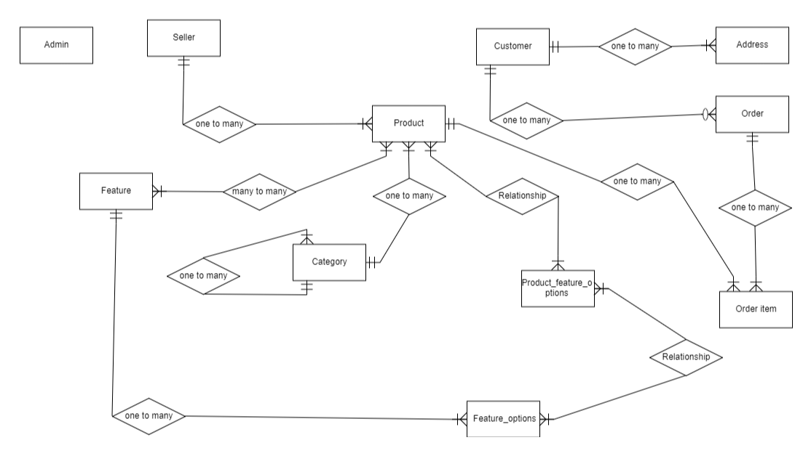

<p align="center"><a href="https://laravel.com" target="_blank"></a></p>

# Online Shop
## Description
This is an online shop built using the Laravel framework.
It includes features for sellers, customers, and admin users to manage products,
orders, and the overall system.

## Table of Contents
- [Installation](#installation)
- [ERD Diagram](#erd-diagram)
- [License](#license)
- [Contact](#contact)

## Installation
1. Clone the repository:
   ```sh
   git clone https://github.com/nazaninns/online-shop.git
   cd online-shop

2. Install dependencies:
    ```sh
   composer install

3. Copy the .env file and generate the application key:
    ```sh
   cp .env.example .env
    php artisan key:generate

4. Set up your database credentials in the .env file.


5. Run migrations:
    ```sh
   php artisan migrate
6. Serve the application:
    ```sh
   php artisan serve

## ERD Diagram



## License

The Laravel framework is open-sourced software licensed under the [MIT license](https://opensource.org/licenses/MIT).

## Contact
- [nazaninnsq@gmail.com](mailto:nazaninnsq@gmail.com)
-  [nazaninns/online_shop](https://github.com/nazaninns/online-shop)
